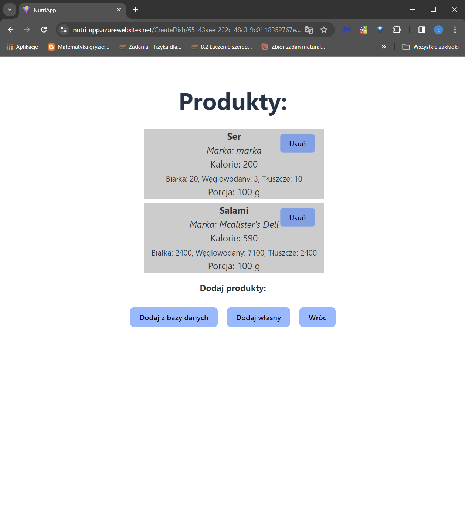

# Nutri App
Aplikacja internetowa, umożliwiająca komponowanie posiłków, dodawanie ich do
jadłospisu oraz podsumowująca dzienne spożycie kalorii oraz makroskładników.
<br/><br/>
Projekt został zrealizowany w ASP.NET 8.0 po stronie Back-endu oraz React.js po stronie Front-endu, stworzony na podstawie szablonu MS Visual Studio - ```React App```.
## Autorzy
- Łukasz Gawron
- Oskar Witek
## Baza danych
Przed uruchomieniem aplikacji należy najpierw stworzyć serwer Microsoft SQL Server np. uruchamiając go lokalnie w kontenerze dockerowym. W celu pobrania obrazu należy skorzystać z komendy:
```
docker pull mcr.microsoft.com/mssql/server
```
Następnie, w celu skonfigurowania obrazu należy podążąć za instrukcją zamieszczoną na stronie:  [https://hub.docker.com/_/microsoft-mssql-server](https://hub.docker.com/_/microsoft-mssql-server)
<br/><br/>
W pliku konfiguracyjnym ```NutriApp.Server/appsettings.Development.json``` należy poprawnie zamieścić Connection String do bazy danych:
```json
  "ConnectionStrings": {
    "AppDbConnection": "Server=localhost;Database=NutriAppDb;User Id=sa;Password=YOUR_STRONG_PASSWORD;TrustServerCertificate=True"
  }
```
Ostatnim krokiem jest stworzenie bazy danych za pomocą migracji. Należy zainstalować narzędzie do obsługi Entity Framework z poziomu konsoli:
```
dotnet tool install --global dotnet-ef
```
Następnie dokonujemy migracji za pomocą komendy:
```
dotnet ef database update
```
Po wykonaniu wszystkich kroków Entity Framework powinien utworzyć bazę danych wraz ze wszystkimi tabelami i niezbędnymi indeksami.
## Fat Secret API
Aplikacja wykorzystuje integrację z API [FatSecret](https://platform.fatsecret.com), dzięki czemu możliwe jest wyszukiwanie oraz dodawanie produktów do posiłków z zewnętrznej bazy danych.
W celu skorzystania z platformy należy założyć darmowe konto, a następnie zamieścić ID oraz klucz w pliku konfiguracyjnym ```NutriApp.Server/appsettings.Development.json```:
```json
 "FoodApiSettings": {
    "ClientId": "PRIVATE_KEY",
    "ClientSecret": "PRIVATE_SECRET"
  }
```
## Uruchomienie
Należy wykonać następujące polecenia:
```
dotnet publish .\NutriApp.Server\ --configuration Release
cd .\NutriApp.Server\bin\Release\net8.0\publish
.\NutriApp.Server.exe --urls http://APP_ADDRESS:APP_PORT
```
- __UWAGA 1: Należy upewnić się, że podany URL znajduje się w sekcji AllowedOrigins w ```NutriApp.Server/appsettings.json``` w celu poprawnej konfiguracji polityki CORS.__
- __UWAGA 2: Należy upewnoć się, że w zmiennych środowiskowych ```nutriapp.client/.env``` znajduje się poprawny URL na jakim wystawione jest REST API.__
## Prezentacja aplikacji
- W celu używania aplikacji nalezy zarejestrować konto.
<br/>


- Po pierwszym uruchomieniu należy podać informacje użytkownika.
<br/>


- Po wykonaniu akcji, użytkownik może w pełni korzystać z aplikacji.
<br/>

- Użytkownik posiada możliwość dodawania posiłków do dziennego jadłospisu.
<br/>


- Posiłki można komponować z dowolnej ilości produktów.
<br/>


- Istnieje możliwość dodawania własnych produktów.
<br/>


- Można również dodawać produkty z API FatSecret.
<br/>


- Do jadłospisu można dodawać po 7 posiłków, każdy składający się z jednego dania. Aplikacja oblicza aktualne spożycie kalorii oraz makroskładników.
<br/>


